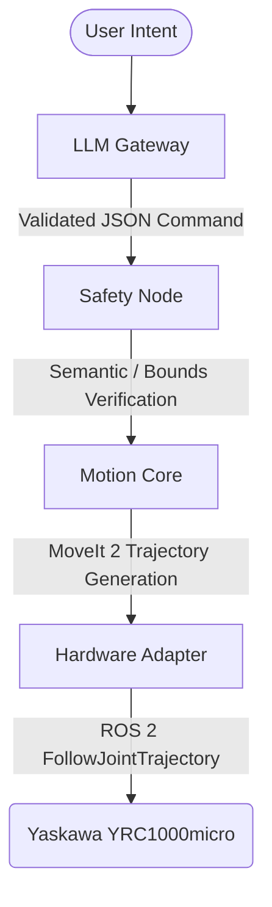

# Yaskawa GP4 / YRC1000micro — ROS 2 Agentic Robot Control

[](https://docs.ros.org/en/humble/)
[](https://moveit.ros.org/)
[](https://opensource.org/licenses/Apache-2.0)

An end-to-end, deterministic LLM-driven motion planning and execution system for the **Yaskawa GP4** industrial robot arm with **YRC1000micro** controller. This system is built strictly for **ROS 2 Humble + MoveIt 2 + MotoROS2**, translating natural language intents into robust, collision-aware, and hardware-safe robot actions.

---

## 📖 Table of Contents

1. [Core Features](#-core-features)
2. [System Architecture](#-system-architecture)
3. [Safety & Constraints](#-safety--constraints)
4. [Supported Primitives](#-supported-primitives)
5. [Prerequisites](#-prerequisites)
6. [Installation & Build](#-installation--build)
7. [Getting Started (Simulation & Real Robot)](#-getting-started)
8. [Example Commands](#-example-commands)
9. [Configuration](#-configuration)

---

## 🌟 Core Features

- **LLM Intent Gateway:** Translates user requests into formal structured commands with strictly enforced JSON schemas.
- **Fail-Closed Safety Engine:** A robust semantic gatekeeper that evaluates targets against workspace bounds, singular positions, and mechanical constraints before planning even occurs.
- **Advanced Motion Core:** Incorporates collision-aware planning via MoveIt 2, intelligent inverse kinematics (TRAC-IK), and smooth trajectory generation (TOTG + Ruckig).
- **Hardened Execution Pipeline:** Connects directly via the standard MotoROS2 driver. Separates logic into motion blocks, state queries, and hardware I/O management.

---

## 🏛 System Architecture

The project enforces rigid separation of concerns. Raw LLM output is entirely isolated from controller execution until it passes multiple stages of semantic and geometric validation.



| Package             | Responsibility                                                                                                                              |
| ------------------- | ------------------------------------------------------------------------------------------------------------------------------------------- |
| `llm_gateway`       | Submits natural language context/goals to LLM, parses formal responses, performs syntax checks.                                             |
| `safety`            | Operates as the "quality gate". Performs collision bounds checks and verifies if the robot is allowed to proceed (e-stop states, warnings). |
| `motion_core`       | The central planner router. Generates PTP, LIN, CIRC plans, executes IK, applies time parameterization.                                     |
| `hw_adapter`        | The exclusive backend interfacing with the physical robot/simulator logic. Dispatches motion and non-motion primitives.                     |
| `supervisor`        | Diagnostics, telemetry logging, auditing, benchmark evaluation.                                                                             |
| `primitives`        | Core ROS definitions for complex and atomic motions (e.g., Joint targets, Cartesian targets).                                               |
| `interfaces`        | `ExecuteMotion.action`, `GetCurrentPose.srv`, etc.                                                                                          |
| `gp4_bringup`       | Unified launch files (real system and fake simulation modes).                                                                               |
| `gp4_moveit_config` | Auto-generated/updated MoveIt 2 semantic descriptions and limits.                                                                           |

---

## 🛡 Safety & Constraints

You are interacting with real industrial hardware. By default, **Safety overrides speed and convenience.**

- **No Direct LLM Actuation:** Natural language is strictly abstracted. The LLM creates an intermediate schema which the deterministic ROS stack evaluates.
- **Pre-execution Simulation:** Workflows default to planning only (`execute: false` flag support).
- **Conservative Kinematics:** Velocity and acceleration are forcibly throttled in `motion_core` regardless of user requests unless verified.
- **Fail Closed:** Any parse failure, IK failure, collision warning, or hardware timeout immediately aborts the active plan and halts the manipulator.

---

## 🔌 Supported Primitives (Version 1.2)

12 base operations are supported and fully integrated across the 4-tier pipeline.

### Motion Primitives

| Primitive       | Description                                              |
| --------------- | -------------------------------------------------------- |
| **HOME**        | Moves to the safe factory default position.              |
| **PTP**         | Point-to-Point joint configuration move.                 |
| **LIN**         | Cartesian linear translation.                            |
| **MOVE_REL**    | Relative Cartesian displacement from current TCP.        |
| **MOVE_JOINT**  | Moves a single designated joint index to a target angle. |
| **MOVE_JOINTS** | Alias for a multi-axis `PTP` configuration sequence.     |

### Logic & Device Primitives

| Primitive       | Description                                                      |
| --------------- | ---------------------------------------------------------------- |
| **WAIT**        | Blocking execution pause for a target duration in seconds.       |
| **STOP**        | Emergency execution request. Cancels current goals.              |
| **SET_SPEED**   | Applies dynamic scalar to subsequent paths.                      |
| **GET_POSE**    | Queries current Cartesian XYZ/RPY and joint vectors.             |
| **IO_SET**      | Addresses arbitrary PLC logical I/O blocks via MotoROS2 mapping. |
| **ALARM_RESET** | Submits fault reset to active MotoROS2 driver.                   |

---

## 📋 Prerequisites

- **OS:** Ubuntu 22.04 LTS
- **ROS 2:** Humble Hawksbill (desktop install)
- **Middleware:** `CycloneDDS` or `FastRTPS` (tuned for industrial networks)
- **Robot Controller:** YRC1000micro loaded with the latest MotoROS2 application file (`.out`).
- **Dependencies:**
  - `moveit2`
  - `ros2_control`
  - `motoros2_client_interface_dependencies`

---

## 🚀 Installation & Build

```bash
# 1. Source ROS 2 environment
source /opt/ros/humble/setup.bash

# 2. Go to workspace
cd ~/gp4_ws

# 3. Import upstream and initialize dependencies (If not already completed)
vcs import src < src/yaskawa_deps.repos  # Example, if using vcs
rosdep install --from-paths src --ignore-src -y

# 4. Build the entire agentic stack
colcon build --symlink-install --cmake-args -DCMAKE_BUILD_TYPE=Release

# 5. Source the overlay
source install/setup.bash
```

---

## 🎮 Getting Started

### Option 1: Simulation (Fake Hardware)

Highly recommended before physical actuation. Uses standard `fake_components` to test kinematic resolutions.

```bash
ros2 launch gp4_bringup sim.launch.py
```

### Option 2: Physical Hardware Execution

Make sure the physical YRC1000 controller is in _REMOTE_ mode, E-STOPs are cleared, and MotoROS2 service is actively broadcasting.

```bash
ros2 launch gp4_bringup system.launch.py robot_ip:=192.168.1.33
```

---

## 📝 Example Commands

While an LLM naturally infers these via CLI strings, you can forcefully inject JSON structures for testing.

**1. Linear Move (LIN)**

```bash
ros2 topic pub --once /llm_raw_command std_msgs/msg/String \
  "data: '{\"primitive_type\": \"LIN\", \"target_pose\": {\"position\": {\"x\": 0.3, \"y\": 0.0, \"z\": 0.2}, \"orientation\": {\"roll\": 3.14, \"pitch\": 0.0, \"yaw\": 0.0}}, \"velocity_scale\": 0.1}'"
```

**2. Relative Base Link Offsets (MOVE_REL)**

```bash
ros2 topic pub --once /llm_raw_command std_msgs/msg/String \
  "data: '{\"primitive_type\": \"MOVE_REL\", \"delta_z\": -0.05}'"
```

**3. Tool/Controller I/O Trigger (IO_SET)**

```bash
ros2 topic pub --once /llm_raw_command std_msgs/msg/String \
  "data: '{\"primitive_type\": \"IO_SET\", \"io_address\": 10010, \"io_value\": 1}'"
```

**4. Emergency Stop Routine (STOP)**

```bash
ros2 topic pub --once /llm_raw_command std_msgs/msg/String \
  "data: '{\"primitive_type\": \"STOP\"}'"
```

---

## ⚙️ Configuration

The LLM logic requires proper authentication limits. Set your keys explicitly on your shell or inject them carefully via ROS parameters.

| Environment Variable | Description                                                    |
| -------------------- | -------------------------------------------------------------- |
| `GP4_LLM_API_KEY`    | Key needed to run the `llm_gateway` node backend connection.   |
| `MOTO_MAX_VEL`       | (Optional) Global percentage cap. Defaults to 10% in `safety`. |

> **Note:** Edit the `parameters.yaml` under `llm_gateway/config/` for model choices, token lengths, and temperature values.

---

_For issues, feature requests, or contributions, please utilize standard internal pull/merge requests adhering to the core engineering philosophy (KISS, determinism, traceability)._
